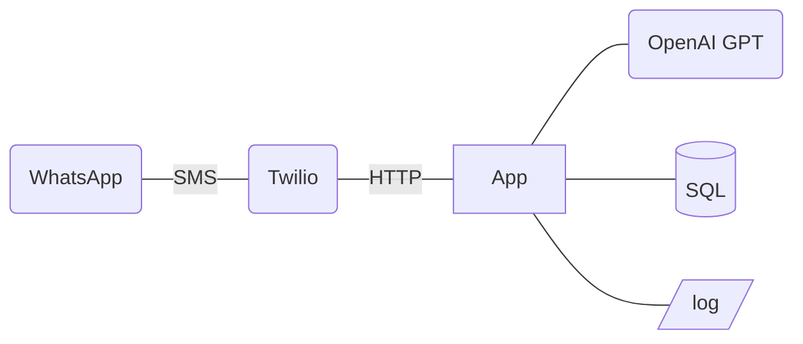

# TODO

## Proof-of-concept connections

- [ ] (Twilio - WhatsApp) connection
- [ ] (App - Twilio) connection
- [ ] (App - GPT) connection
- [ ] (App - DB & log) workflow

## Busines logic
- [ ] Process 
